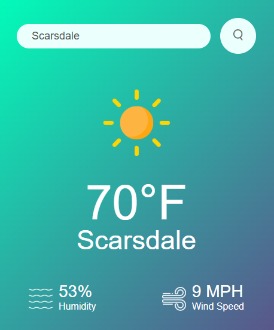

 
  <h1 align="center">WEATHER BOY</h1>

  

   A WEATHER APP CREATED WITH JAVASCRIPT
  

<!-- Table of Contents -->

  
Table of Contents

  <ol>
    <li>
      <a href="#about-the-project">About The Project</a>
      <ul>
        <li><a href="#built-with">Built With</a></li>
      </ul>
    </li>
    <li>
      <a href="#Instructions">Instructions</a>
    </li>
    <li><a href="#contact">Contact</a></li>
  </ol>

<!-- ABOUT THE PROJECT -->

## About The Project

  

This project is a modern JavaScript-based weather application that fetches real-time weather data using the OpenWeather API. Built as a refresher on core JavaScript concepts, the app showcases asynchronous API handling, dynamic DOM manipulation, and responsive design principles. Users can search for current weather conditions by city, view temperature, humidity, and weather icons, all within a clean and user-friendly interface.

(<a href="#top">back to top</a>)

### Built With

(<a href="#top">back to top</a>)

<!-- GETTING STARTED -->

## Instructions

1. https://lkocaj.github.io/Weather_Boy/ <- Click [here](https://lkocaj.github.io/Weather_Boy/) to launch the webpage

2. Type in a city of choice.

3. Get your weather

4. GET OUT THERE

(<a href="#top">back to top</a>)

<!-- CONTACT -->

## Contact

✉️ Lawrencekocaj@gmail.com
 
💼 [LinkedIn](https://www.linkedin.com/in/lawrencekocaj/)
 
💻 [github](github.com/lkocaj)
 
📑 [Source Code](https://github.com/LKocaj/Weather_Boy)
 
📑 [Finished Product](https://lkocaj.github.io/Weather_Boy/)
 
🎥 [Youtube](https://www.youtube.com/channel/UCT9VNw7nEAY0jqPlHM6zlSw)

(<a href="#top">back to top</a>)

